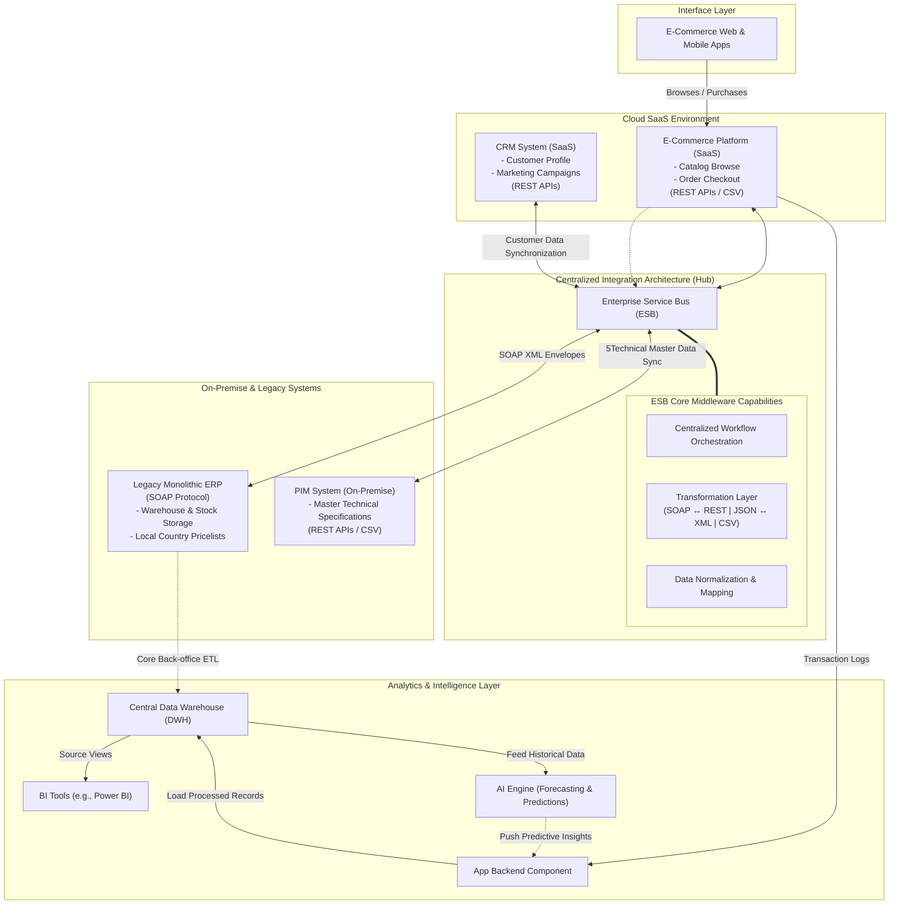

# E-Commerce Platforms

Need for handling spikes in
traffic and separating different business functions
(e.g., payments, product catalog).

---

### Scalability Strategy Example - Amazon and Load Balancing

A web application deployed on multiple server with a load balancer to distribute user requests. 
Amazon’s Elastic Load Balancing (ELB) is a cloud-based example that dynamically routes traffic.

---

### Performance Strategy Example - Amazon and Throughput Monitoring

Example: E-commerce sites like Amazon monitor throughput to ensure they can process thousands of transactions per second during peak times like Black Friday.

---

### Distributed Tracing:
–
 Tools like Jaeger and Zipkin track requests across services,
helping diagnose where bottlenecks occur in distributed
systems.
–
 Example: A company using microservices for an e-commerce
platform can trace a purchase transaction across services
(catalog, cart, payment) to see where delays occur.

---

### Command Query Responsibility Segregation (CQRS):
Separates read and write operations to optimize performance and scalability.

Example: An e-commerce platform could use CQRS by storing customer order history in a read-only database optimized for search queries, while order processing is handled by a write-optimized database.

---

### Event-Driven Architecture:
Uses event messaging to decouple services, reducing processing time.

Example: When a user purchases an item on an e-commerce site, the order service triggers events for inventory, shipping, and notifications, enabling asynchronous processing and faster response times.

---

### Bulkhead Pattern
–
 This pattern isolates different parts of a system to prevent failures in
one component from cascading to others, much like compartments
(bulkheads) on a ship that contain water in the event of a hull breach.
–
 It limits the impact of failures, helping to maintain partial functionality even if one
part of the system encounters issues. This can improve the overall reliability and
resilience of the application.
–
 Example: In a microservices architecture, an e-commerce application might
separate inventory, payment, and order-processing services into different
"bulkheads." If the inventory service fails, it won’t affect the payment service,
allowing users to proceed with payments for other products.

---

### Cache-aside Pattern (Lazy Loading)
–
 With cache-aside (or lazy loading), data is loaded into the cache only
when requested. If the data isn’t in the cache, it’s retrieved from the
database and then stored in the cache for future access.
–
 Reduces load on the database by caching frequently requested data.
Improves response times for users accessing the cached data while
keeping cache storage efficient.
–
 Example: A news website could use cache-aside to store articles in the
cache only after they’re requested. When a user accesses an article for
the first time, the system fetches it from the database and caches it.
Subsequent requests for the same article are served directly from the
cache, speeding up load times.

---

### Point-to-Point Integration
Involves direct connections between two systems. Each connection is built specifically for the systems involved.

Example: Connecting an e-commerce platfor directly to a payment gateway.

---

### Integration at the Data Level
This type focuses on the exchange, transformation, and synchronization of data between systems.

Example: Synchronizing inventory levels between an ERP and an e-commerce platform.

---

### Integration at the Process Level
This approach integrates business workflows across systems, ensuring that processes spanning multiple systems function seamlessly.

Examples: Automating order fulfillment by connecting an e-commerce platform, inventory system, and logistics.

---

### Integration Using Shared Databases
In this approach, multiple systems access a common database to store and retrieve data.

Use Cases:
* A centralized inventory database used by sales, logistics, and warehouse systems.
* A shared customer database accessed by marketing, sales, and support teams.

--- 

## Communication Type

### Synchronous Communication
The client sends a request and waits for an immediate response.

Common Implementation: REST APIs.

Use Cases:
* Real-time interactions like retrieving product details during an online purchase.
* Microservices invoking each other to fetch information.

---

### Asynchronous Communication
The client sends a request and continues processing without waiting for a immediate response. Responses are handled later.

Common Implementation: Message queues (e.g., RabbitMQ, Kafka).

Use Cases:
* Sending notifications to customers after order confirmation.
* Batch processing of data transfers between systems.

--- 

### Microservices Architecture
Microservices break down applications into small, independent services, each responsible for a specific function.

Example: Adding a modern recommendation engine as a microservice integrated with a legacy e-commerce platform.

Challenges:
* Integration Complexity: Requires robust communication mechanisms like event-drive messaging or API gateways.
* Operational Overhead: Managing multiple services increases the need for monitoring, orchestration, and automation.

