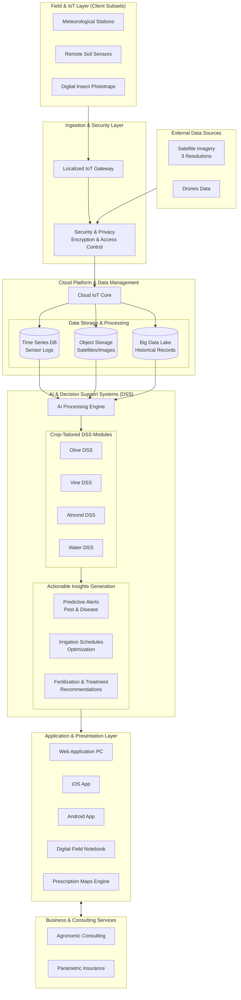
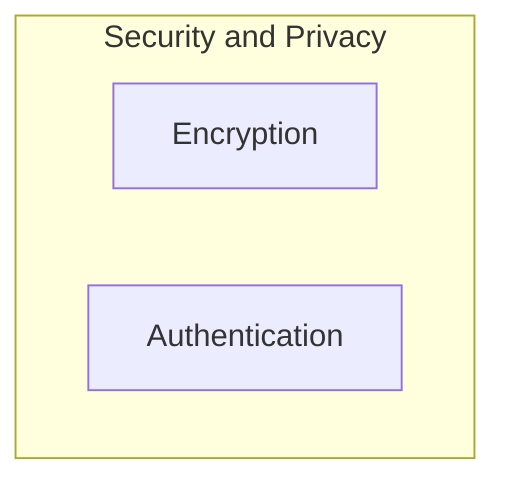

# Elaisian

## Gemini Attempt

```mermaid
flowchart TB
    subgraph FIELD_LAYER["Field & IoT Layer (Client Subsets)"]
        direction LR
        MET[Meteorological Stations]
        SOIL[Remote Soil Sensors]
        TRAP[Digital Insect Phototraps]
    end

    subgraph EXTERNAL_DATA["External Data Sources"]
        direction LR
        SAT[Satellite Imagery\n3 Resolutions]
        DRN[Drones Data]
    end

    subgraph EDGE_INGESTION["Ingestion & Security Layer"]
        GW[Localized IoT Gateway]
        SEC[Security & Privacy\nEncryption & Access Control]
    end

    subgraph CLOUD_PLATFORM["Cloud Platform & Data Management"]
        direction TB
        IoT_HUB[Cloud IoT Core]
        
        subgraph STORAGE["Data Storage & Processing"]
            TS_DB[(Time Series DB\nSensor Logs)]
            OBJ_ST[(Object Storage\nSatellites/Images)]
            BIG_DATA[(Big Data Lake\nHistorical Records)]
        end
    end

    subgraph AI_ENGINE["AI & Decision Support Systems (DSS)"]
        direction TB
        AI_MODELS[AI Processing Engine]
        
        subgraph DSS_MODULES["Crop-Tailored DSS Modules"]
            OLIVE[Olive DSS]
            VINE[Vine DSS]
            ALMOND[Almond DSS]
            WATER[Water DSS]
        end
        
        subgraph INSIGHTS["Actionable Insights Generation"]
            ALERT[Predictive Alerts\nPest & Disease]
            IRR[Irrigation Schedules\nOptimization]
            FERT[Fertilization & Treatment\nRecommendations]
        end
    end

    subgraph APPLICATION_LAYER["Application & Presentation Layer"]
        WEB[Web Application PC]
        IOS[iOS App]
        AND[Android App]
        NOTEBOOK[Digital Field Notebook]
        MAPS[Prescription Maps Engine]
    end

    subgraph EXTERNAL_SERVICES["Business & Consulting Services"]
        CONSULT[Agronomic Consulting]
        INS[Parametric Insurance]
    end

    %% Flow Connections
    FIELD_LAYER --> GW
    GW --> SEC
    EXTERNAL_DATA --> SEC
    SEC --> IoT_HUB

    IoT_HUB --> TS_DB
    IoT_HUB --> OBJ_ST
    IoT_HUB --> BIG_DATA

    TS_DB & OBJ_ST & BIG_DATA --> AI_MODELS
    AI_MODELS --> DSS_MODULES
    DSS_MODULES --> INSIGHTS

    INSIGHTS --> APPLICATION_LAYER
    APPLICATION_LAYER <--> EXTERNAL_SERVICES
```

---

## My attempt

```mermaid
flowchart TB

    %% Security and Privacy
    subgraph "Security and Privacy"
        ENCR[Encryption]
        AUTH[Authentication]
    end


```