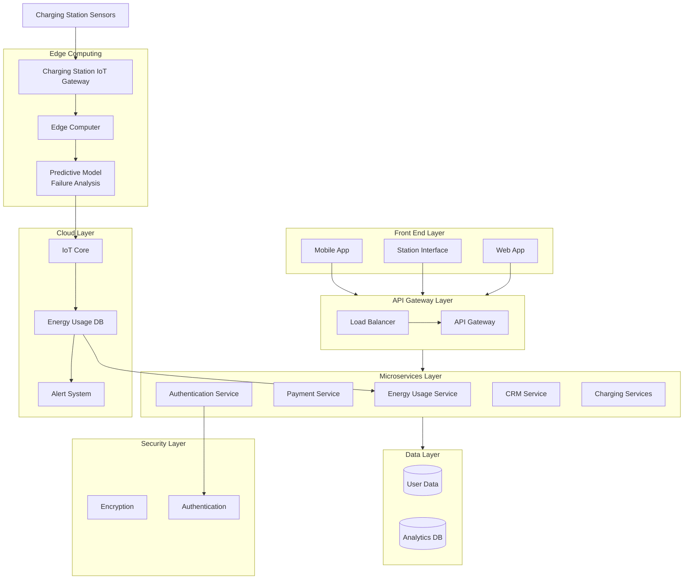
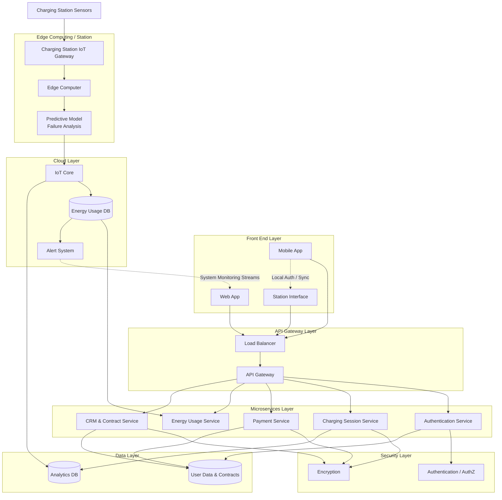
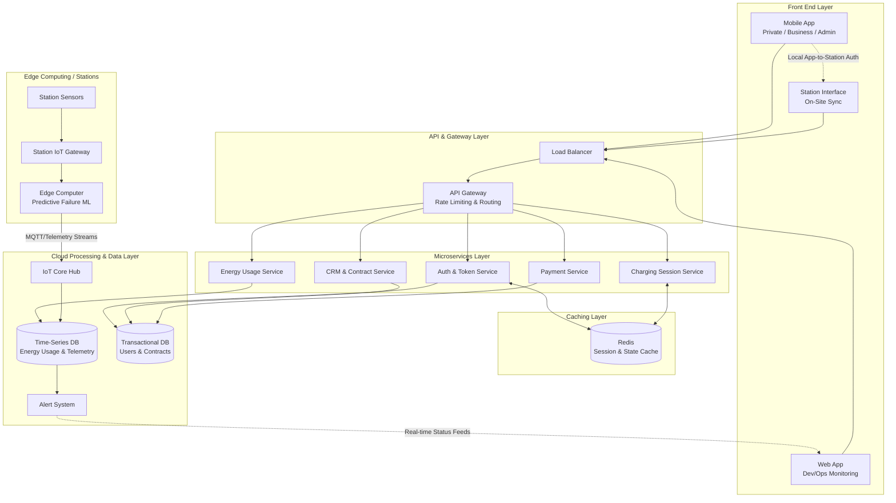

# Eleven

---

## Notes

Large Scale -> Microservices
Cloud 

---

## Attempt

### Notes

* IoT
  * Platforms for remote assett management and monitoring

### Assumptions

Assumptions

* All users (private, businesses, administrations) rely on the same app, while the developers use the web app for monitoring.
* The charging stations have their own App/Interface (needed for payments on site)
  * We assume that we must be connected, through the app (after auth), to the station to make payments (no on-site payments with card, just app)
* We also have a Web App for Monitoring Systems

## Schema

---

## Attempt 1 - Gemini

## Attempt 2 - Gemini

Perfect, missing
* Kafka for async communication (monitoring)
* Security layer (encryption, authentication)