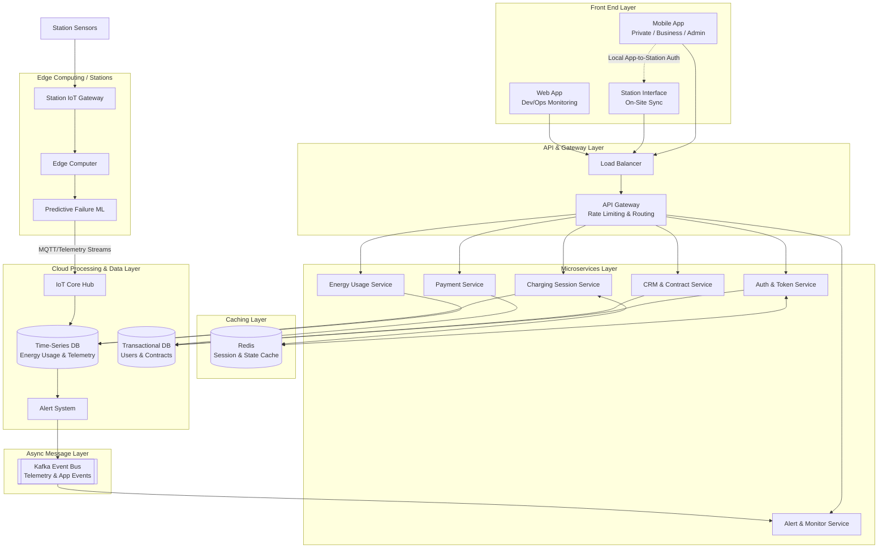

# Eleven

---

## Notes

Large Scale -> Microservices
Cloud 

---

## Attempt

### Notes

* IoT
  * Platforms for remote assett management and monitoring

### Assumptions

Assumptions

* All users (private, businesses, administrations) rely on the same app, while the developers use the web app for monitoring.
* The charging stations have their own App/Interface (needed for payments on site)
  * We assume that we must be connected, through the app (after auth), to the station to make payments (no on-site payments with card, just app)
* We also have a Web App for Monitoring Systems

## Schema

Perfect, missing
* Sensors must be outside Edge Computing, in a dedicated module for stations
* Decouple Edge Computing and Predictive Model Failure ML Pipeline
* Alert System becomes Alert and Monitoring System. Then, connect it to a Kafka Communication Module. Connect this module to a NEW Monitor Service in Microservice
* Add separate Data Layer (for Transactions and User Info) or Assume Full-Cloud Solution and rename layer to Cloud and Data Layer
* Assume charging sessions data goes to time series db
* Security layer (encryption, authentication)