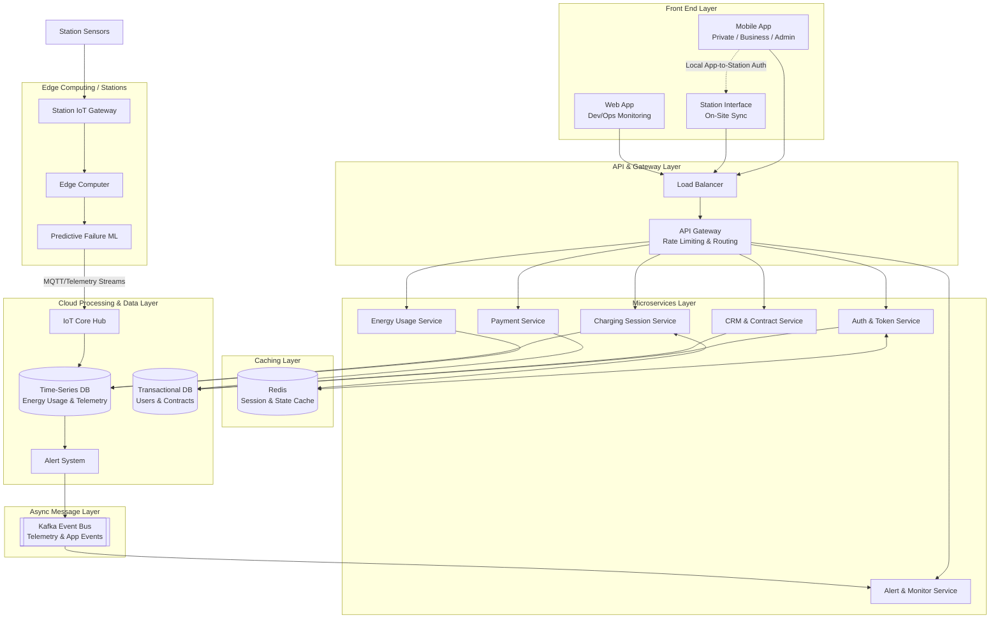

# Eleven

## Exam

### Introduction

Eleven is a company specialized in the design, installation, and management of electric vehicle (EV) charging infrastructure. It delivers modular solutions that include AC and DC charging stations, software platforms for remote monitoring and maintenance, and energy-management services for private customers, enterprises, and public administrations.

### Objective

The objective of this exam is to propose architectural and organizational solutions to implement a Large-scale EV charging infrastructure comparable to the services offered by Eleven, encompassing both technical system design and operational considerations.

### Case Study Overview

An Eleven-style ecosystem typically includes:

* A distributed network of AC and DC charging stations
* IoT platforms for **remote asset management** and **monitoring**
* **Mobile applications** for end-users
* **Billing**, **authentication**, and **contract-management systems**
* **Cloud** infrastructure for **analytics**, **control**, and energy optimization
* **Integration with a payment service provider** (in app and in the charging station, too)

### Architectural Solutions

#### System Integration

Integrate all charging-network components into a unified platform that manages **charging sessions**, IoT **monitoring**, user **authentication**, **billing**, and **energy-usage analytics**.

#### Data Management Frameworks

Develop a data management framework that **captures and processes telemetry** from the **charging stations**—including device status, energy consumption, charging sessions, and diagnostics. **Cloud-based processing** is essential for scalability, high availability, and efficient analysis of large data volumes.

#### Security and Privacy

Ensure data security and privacy by implementing **encryption**, **secure access controls**, and compliance with relevant regulations.

### Organizational Solutions

#### Recommended Project Management Methodology

For the successful execution of this project, it is essential to select and adopt the project management methodology that is most appropriate for its unique requirements. The chosen methodology should align with the project's goals, complexity, and collaborative needs, ensuring effective planning, execution, and delivery.

#### Team Structure

A successful implementation requires a multidisciplinary team including:

* Electrical engineers and field installers
* IoT and embedded-systems engineers
* Cloud and backend software developers
* Mobile application developers
* Data scientists and AI engineers
* Maintenance technicians and operations-center personnel
* Smart-grid and energy-management specialists
* QA and testing teams

---

## 📓 Notes

---

## 🔑 Keypoints

* IoT
  * Platforms for remote assett management and monitoring

---

## 🗨️ Assumptions

What assumptions can we make?

* All users (private, businesses, administrations) rely on the **same app**, while the developers (or maintainers) use the Web App (or interface) for monitoring.
  * The app offers
    * Authentication & User Profile Service
    * Payment & Billing Service
    * Contract & CRM Services
    * **Alert & Monitor Service** and **Session Charging Service**, which monitor the client-side of the things. In other words, they can be used to notify in case of problems from the customer side (faulty charging device or incompatibility), but also to monitor aspects like device status, energy consumption, charging sessions, and diagnostics.
    * Everything here focuse on everything BUT the charging station
  * The Web App offers
    * **Authentication & User Profile Service** to deal with authorizations and avoid data breaches. In this case we try to respect privacy policies by showing, say, anonymized data to the Data Scientist, and only access location/slight user info (ex: billing address) to a team of maintainers. This also involves dividing the visualizations by role.
    * **Alert & Monitor Service** and **Session Charging Service**, which act differently for developers. In fact, they show deeper info about the single charging stations (like last maintanance, temperatures, and other info from on-site sensors). They also have a dashboard for diagnostics, metrics to monitor.
* The charging stations 🔌
  * They are **located on-site** (in the customer property).
  * They **have their own networking stack**. This means they are not connected directly to the customer's wifi (or any other network). For example, they could have their own antennas.
  * They have a **series of sensors** (which we abstract because they change with different designs)
  * They have their own App/Interface (needed for payments on site)
* For what concerns payments, we have a payment service that offers the following options
  * Default: Pay, from anywhere (remotely), by using the app. This payment service exploits Stripe and Paypal for secure payments. This can be done also by automatically billing the chosen mean of payment, or set something else up through the payment service, which also handles billing.
  * Pay on-site (charging station): We assume that we must be connected, through the app (after auth), to the station to make payments (no on-site payments with card, just through the app). In other words, we first sync the app with the charging station (using bluetooth, nfc) and then we can pay from the app. This helps facilitate using different payment methods for different charged devices (for instance, pay with different means of payment for different devices).
* We assume that we move to a full-cloud solution for data, which can be conviniently stored in cloud.

Perfect, missing
* Sensors must be outside Edge Computing, in a dedicated module for stations
* Decouple Edge Computing and Predictive Model Failure ML Pipeline
* Alert System becomes Alert and Monitoring System. Then, connect it to a Kafka Communication Module. Connect this module to a NEW Monitor Service in Microservice
* Add separate Data Layer (for Transactions and User Info) or Assume Full-Cloud Solution and rename layer to Cloud and Data Layer
* Assume charging sessions data goes to time series db
* Security layer (encryption, authentication)

---

## 🖊️ Schema

### Description

---

## 🫂 Project Management

