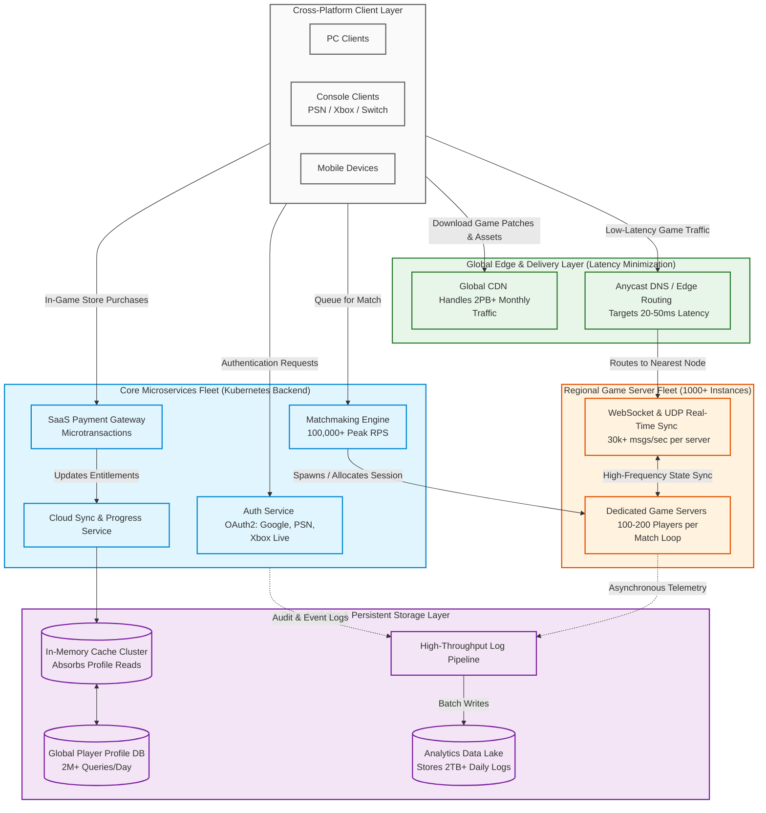
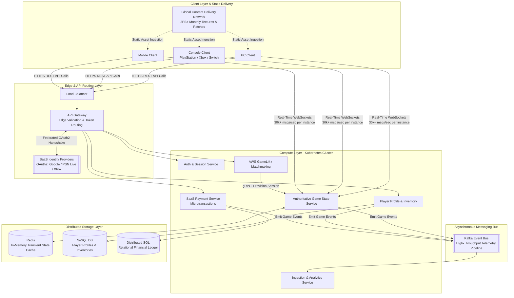

# Fortnite

The delay before data begins to transfer after a request is
made. Minimizing latency is critical for real-time
applications like gaming or video streaming.

Example: In online gaming, high latency causes lag,
disrupting the user experience. Techniques to reduce
latency include reducing network hops and optimizing
backend processing times.

Fortnite’s Architecture:
– Microservices-Based Backend:
• Uses Kubernetes to scale services such as matchmaking and account management.
– SaaS Integration:
• OAuth2 support for logins with Google, PlayStation Network, and Xbox Live accounts.
• SaaS payment systems to handle microtransactions.
– Cross-Platform Play:
• Players on consoles, PCs, and mobile devices can play together.
• Cloud synchronization for progress and purchases.

Results:
– Millions of simultaneous players.
– Service continuity even during global updates, thanks to distributed systems.
– Effective monetization with personalized in-game purchases.

Concurrent Users (peak): 15.3M+ (during
special events).
Concurrent Users (daily average): Millions of
wolrdwide players.
Monthly Active Users (MAU): 350M registered
users.

Client-server calls per second:
– Matchmaking and authentication: 100.000+ of
requests per second during peak
– WebSocket and Real-Time updates: 30.000+
messages per second per game server.

Latency: 20-50ms for most players using
regionally distributed servers.

Game severs in operation: 1000+ of server
instance on cloud providers.
– Each server suppors 100-200 players per match
DB queries for player profiles: 2M+ of queries
per day.
Logged Events: 2TB+/daily for every player.
CDN: handling 2PB+ of monthly traffic.
Cost per player: about $0.01 per player per day
on cloud infrastructure, depending on global
demand

--- 

## Fortnite - Gemini 1

---

## Fortnite - Gemini 2

If the case study were adapted for Fortnite using the architectural specifications and metrics detailed in lecture-11-devmet-services-integration-part-4.pdf, the system must pivot from an IoT sensor polling model to a massively scaled, ultra-low-latency game backend capable of handling millions of concurrent connections.

Based explicitly on the engineering realities outlined in your slides (e.g., 30,000+ WebSocket messages per second, 2TB+ of daily log data, and multi-platform SaaS authentication), here is how that high-level Mermaid diagram evolves to pass an architectural exam.

### Component Matrix & Architectural Justifications

* **Cross-Platform Asset Delivery Layer:** Unlike charging stations, games depend heavily on multi-gigabyte client-side rendering engine downloads. A global **CDN layer** handling over 2PB of monthly traffic offloads heavy binary transfers entirely from the core microservices.
* **Federated Edge Authentication:** To support cross-platform progression across PC, console, and mobile clients seamlessly, the **API Gateway** integrates directly with external **SaaS identity solutions** (Google, PSN, Xbox Live) via OAuth2.
* **Dual-Protocol Splitting:**
* **Synchronous REST APIs:** Used for non-time-critical requests (store browsing, reading player inventories, account settings).
* **Persistent WebSockets/UDP Pipelines:** Bypasses standard routing algorithms entirely to sync game state data directly with an authoritative server at a strict 20–50ms latency margin.

* **In-Memory Architecture Shifting:** Instead of utilizing traditional SQL databases for dynamic data, an intensive multi-player backend maps core state components strictly into an **In-Memory Cluster (Redis)** to handle thousands of operations per second without write locking.
* **The 2TB+ Event Pipe (Kafka):** Telemetry flows continuously from running match instances. Direct database storage would instantly trigger bottlenecks; instead, events push straight into **Kafka** before batch-processing routines securely move archival data onto analytics warehouses.