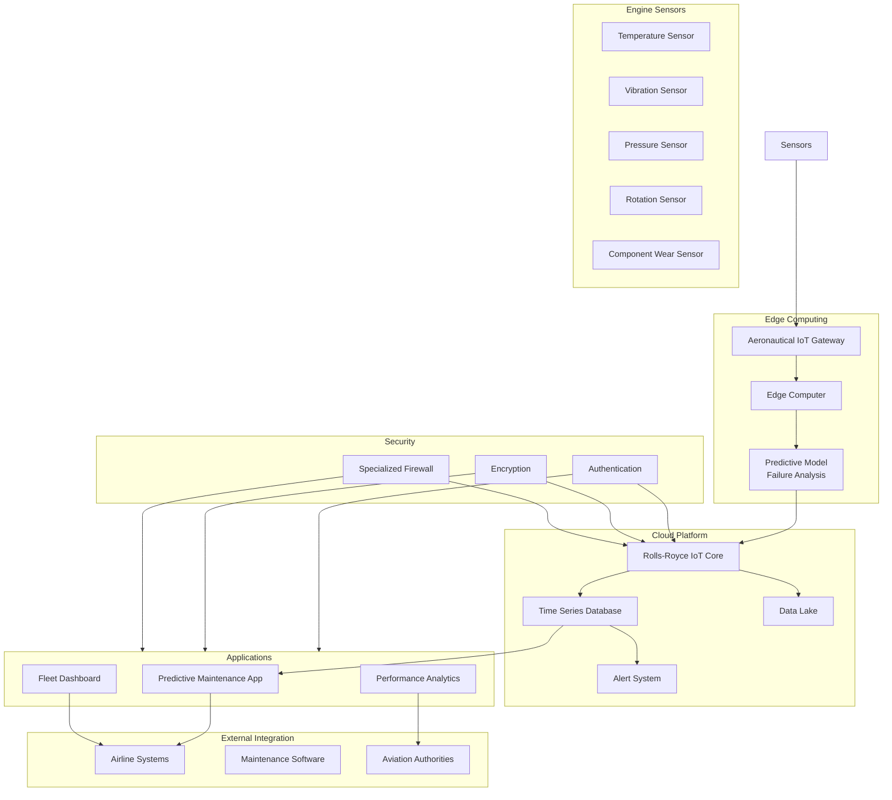

# IOT

```mermaid
flowchart TB
    subgraph "Engine Sensors"
        T[Temperature Sensor]
        V[Vibration Sensor]
        P[Pressure Sensor]
        R[Rotation Sensor]
        O[Component Wear Sensor]
    end

    subgraph "Edge Computing"
        GW[Aeronautical IoT Gateway]
        EC[Edge Computer]
        ML[Predictive Model\nFailure Analysis]
    end

    subgraph "Cloud Platform"
        IoTCore[Rolls-Royce IoT Core]
        TSDatabase[Time Series Database]
        DataLake[Data Lake]
        AlertSystem[Alert System]
    end

    subgraph "Applications"
        MaintenanceApp[Predictive Maintenance App]
        FleetDashboard[Fleet Dashboard]
        PerformanceAnalytics[Performance Analytics]
    end

    subgraph "External Integration"
        Airlines[Airline Systems]
        MRO[Maintenance Software]
        Regulators[Aviation Authorities]
    end

    subgraph "Security"
        AUTH[Authentication]
        ENCRYPT[Encryption]
        FIREWALL[Specialized Firewall]
    end

    Sensors --> GW
    GW --> EC
    EC --> ML
    ML --> IoTCore

    IoTCore --> TSDatabase
    IoTCore --> DataLake
    
    TSDatabase --> AlertSystem
    TSDatabase --> MaintenanceApp
    
    MaintenanceApp & FleetDashboard --> Airlines
    PerformanceAnalytics --> Regulators

    AUTH & ENCRYPT & FIREWALL --> IoTCore
    AUTH & ENCRYPT & FIREWALL --> Applications
```