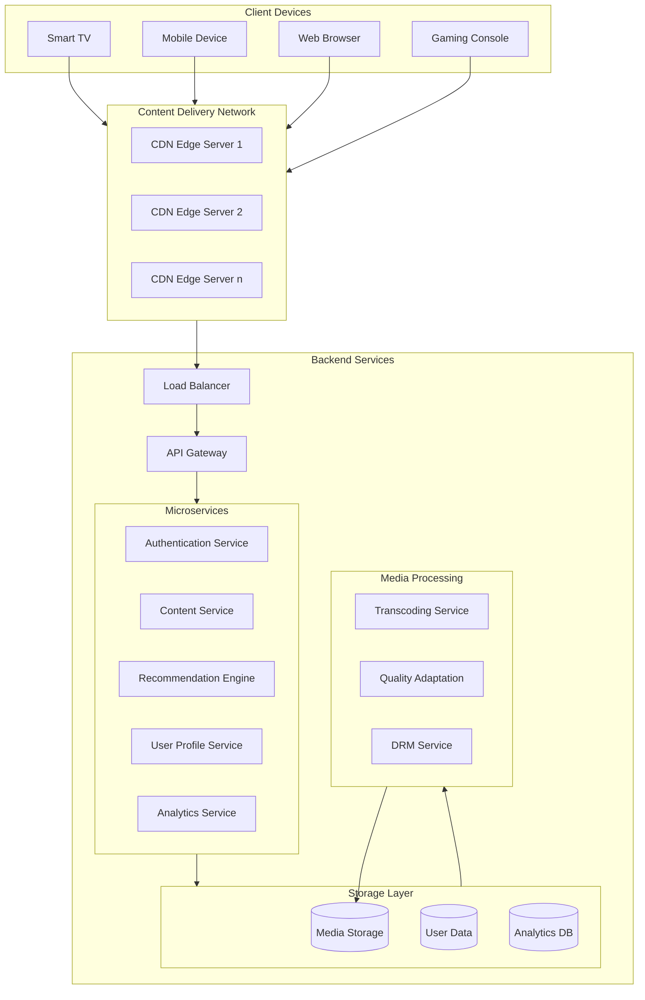

# Netflix

Video streaming based on complex infrastructure

What are its features?

* CDN
  * Thousands of server nodes distributed globally
  * Stores cached copies of content close to end-users
  * Reduces latency and bandwidth costs
  * Handles about 95% of streaming traffic
  * Backend services
    * Load Balancer distributes traffic across services
    * API Gateway handles client requests and routing
    * Microservices contains the business logic
* Storage layer
  * Media Storage: Original and transcoded content
  * User Data: Preferences, viewing history, accounts
  * Analytics Database: Viewing patterns, performance metrics
* Media processing
  * Transcoding Service: Creates multiple quality versions of videos
  * Quality Adaptation: Manage different bitrates and resolutions
  * DRM Service: Handles content protection

What technologies are used?

* Java and Node.js for microservices
* Cassandra for distributed databases
* Redis for caching
* Kafka for message queuing
* ELK Stack for logging

---

## Project Management

It uses the DevOps methodology to maintain a high level of reliability and availability of its services

See [Chaos Monkey](https://netflix.github.io/chaosmonkey/) for “failure as a service”

Test automation 

