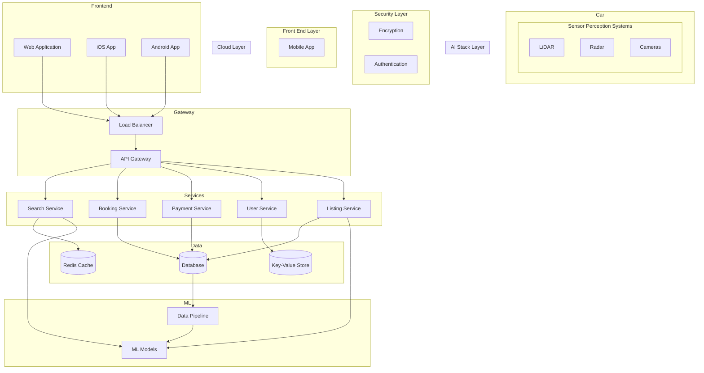
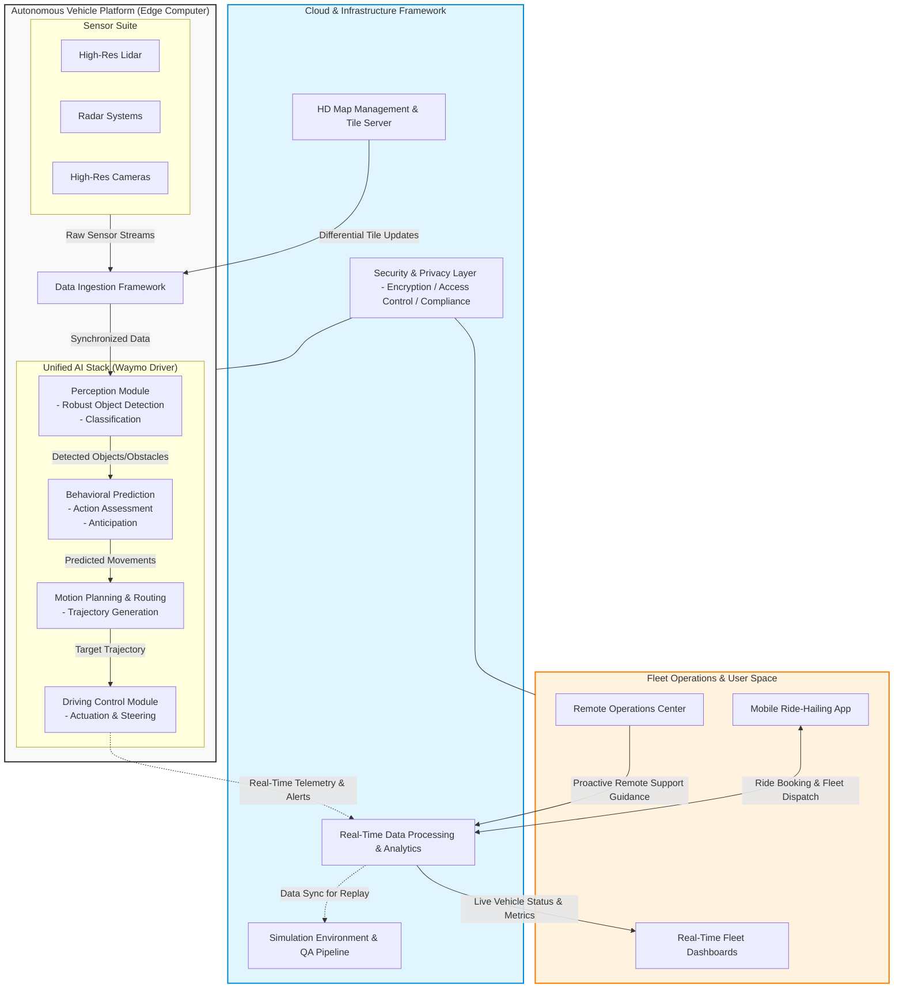

# Waymo

Assumptions:

* Cars only mount
  * Sensors to gather data
  * Antennas to send data to AI Cloud infrastructure
  * All computation is done online

```mermaid
graph TD

    subgraph Car [Car]
        subgraph Sensors[Sensor Perception Systems]
            LiDAR[LiDAR]
            Radar[Radar]
            Cameras[Cameras]
        end

    end

    subgraph AI [AI Stack Layer]
    end

    subgraph Security [Security Layer]
        Encr[Encryption]
        Auth[Authentication]
    end

    subgraph FE [Front End Layer]
        App[Mobile App]
    end

    subgraph Cloud [Cloud Layer]
    end

    subgraph Frontend
        WebApp[Web Application]
        iOS[iOS App]
        Android[Android App]
    end

    subgraph Gateway
        LB[Load Balancer]
        API[API Gateway]
    end

    subgraph Services
        Search[Search Service]
        Booking[Booking Service]
        Payment[Payment Service]
        User[User Service]
        Listing[Listing Service]
    end

    subgraph Data
        DB[(Database)]
        Cache[(Redis Cache)]
        KV[(Key-Value Store)]
    end

    subgraph ML
        Models[ML Models]
        Pipeline[Data Pipeline]
    end

    WebApp --> LB
    iOS --> LB
    Android --> LB
    
    LB --> API
    
    API --> Search
    API --> Booking
    API --> Payment
    API --> User
    API --> Listing
    
    Search --> Cache
    Booking --> DB
    Payment --> DB
    User --> KV
    Listing --> DB
    
    Search --> Models
    Listing --> Models
    
    DB --> Pipeline
    Pipeline --> Models
```

```mermaid
graph TB
    subgraph Vehicle ["Autonomous Vehicle Platform (Edge Computer)"]
        subgraph Hardware ["Sensor Suite"]
            Lidar[High-Res Lidar]
            Radar[Radar Systems]
            Cam[High-Res Cameras]
        end
        
        DI[Data Ingestion Framework]
        
        subgraph AI_Stack ["Unified AI Stack (Waymo Driver)"]
            Perception[Perception Module <br/>- Robust Object Detection<br/>- Classification]
            Prediction[Behavioral Prediction <br/>- Action Assessment<br/>- Anticipation]
            Planning[Motion Planning & Routing <br/>- Trajectory Generation]
            Control[Driving Control Module <br/>- Actuation & Steering]
        end

        Hardware -->|Raw Sensor Streams| DI
        DI -->|Synchronized Data| Perception
        Perception -->|Detected Objects/Obstacles| Prediction
        Prediction -->|Predicted Movements| Planning
        Planning -->|Target Trajectory| Control
    end

    subgraph Cloud ["Cloud & Infrastructure Framework"]
        RT_Proc[Real-Time Data Processing & Analytics]
        HD_Maps[HD Map Management & Tile Server]
        Sim_QA[Simulation Environment & QA Pipeline]
        Security[Security & Privacy Layer <br/>- Encryption / Access Control / Compliance]
    end

    subgraph Operations ["Fleet Operations & User Space"]
        App[Mobile Ride-Hailing App]
        Dashboard[Real-Time Fleet Dashboards]
        ROC[Remote Operations Center]
    end

    %% Data Flows & Integration
    Control -.->|Real-Time Telemetry & Alerts| RT_Proc
    HD_Maps -->|Differential Tile Updates| DI
    RT_Proc -->|Live Vehicle Status & Metrics| Dashboard
    ROC -->|Proactive Remote Support Guidance| RT_Proc
    RT_Proc -.->|Data Sync for Replay| Sim_QA
    App <-->|Ride Booking & Fleet Dispatch| RT_Proc

    %% Security Enforcements
    Security --- Vehicle
    Security --- Cloud
    Security --- Operations

    classDef vehicleStyle fill:#f9f9f9,stroke:#333,stroke-width:2px;
    classDef cloudStyle fill:#e1f5fe,stroke:#0288d1,stroke-width:2px;
    classDef opsStyle fill:#fff3e0,stroke:#f57c00,stroke-width:2px;
    class Vehicle vehicleStyle;
    class Cloud cloudStyle;
    class Operations opsStyle;
```