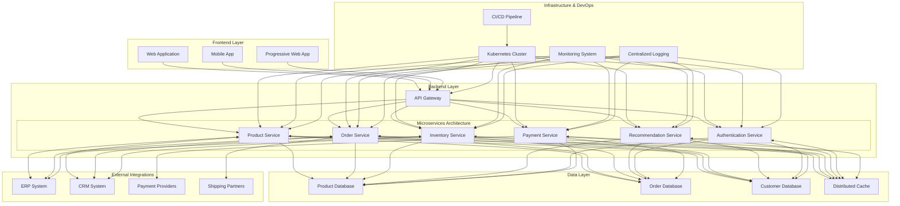

# Zalando Architecture Example

Zalando, a leading European e-commerce platform, implemented a Data Mesh architecture to address challenges in scaling its data operations. The company needed to manage vast amounts of data across multiple domains, including logistics, customer experience, marketing, and inventory management

