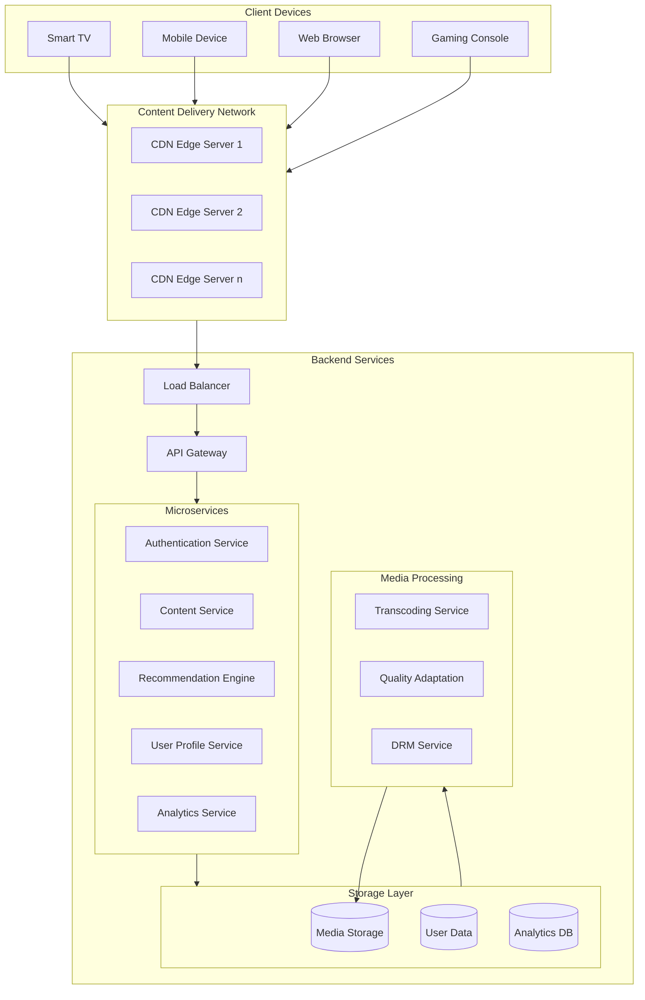

# Performance

In computing, performance refers to how efficiently and effectively a
system, application, or component completes tasks under specified
conditions. Key metrics that define performance include response time
(how quickly the system processes requests), throughput (the amount
of work handled in a given timeframe), and resource utilization
(efficient use of CPU, memory, and storage). High performance is often
characterized by low latency, high reliability, and the system’s ability to
scale under increasing loads without degradation, ensuring smooth user
experience and responsiveness

---
## Metrics

### Latency
The delay before data begins to transfer after a request is made. 

Minimizing latency is critical for real-time applications like gaming or video streaming.

Factors Affecting Latency:
* Network Distance: Data often travels across multiple networks, each adding a small delay (network hops)
* Processing Delays: Backend processing or querying complex databases can add latency.
* Server Load: High traffic can increase latency if servers struggle to keep up.

Example: In online gaming, high latency causes lag, disrupting the user experience. Techniques to reduce latency include reducing network hops and optimizing backend processing times.

### Throughput
Throughput is the total volume of data processed over a
specific period, typically measured in transactions per
second (TPS) or requests per second (RPS).

High throughput is essential for applications handling a
large number of simultaneous requests, ensuring that the
system meets demand without slowing down.

Factors Affecting Throughput:
–
 System Architecture: Distributed systems or microservices can increase
throughput by processing multiple requests concurrently.
–
 Database Performance: Optimized databases and the use of read
replicas help systems handle more data in less time.
–
 Hardware Capacity: Sufficient memory and CPU resources are needed
to avoid bottlenecks.
Example: E-commerce sites like Amazon monitor
throughput to ensure they can process thousands of
transactions per second during peak times like Black
Friday.
### Response Time
Response time is the total time taken for a system to
process a user request and return a result. Low response
times improve the user experience, especially for
applications requiring immediate feedback.
Factors Affecting Response Time:
–
 Backend Processing Time: Complex calculations or large data transfers
can slow response times.
–
 I/O Operations: Slow database or file storage access can increase
response time.
–
 Concurrency Management: Systems that efficiently handle concurrent
requests tend to have better response times.
Search engines like Google prioritize response time; if
queries aren’t returned within milliseconds, users may
leave. Techniques include query optimization and caching
frequently accessed data.
### Error Rate
•
•
•
•
Error rate is the percentage of failed requests out of the
total requests over a given period. A high error rate often
signals issues within the system, like configuration errors,
code bugs, or server overload.
Monitoring error rates is crucial to maintain reliability. A
consistently low error rate indicates that users can rely on
the application to function without interruptions.
Factors Affecting Error Rate:
–
 System Load: High traffic can cause bottlenecks, leading to failed
requests if servers cannot keep up.
–
 Software Bugs: Errors in code, misconfigurations, or poor exception
handling can increase error rates.
–
 Dependency Failures: External services or APIs that a system relies on
can also impact error rate.
Example: Payment platforms like PayPal monitor error
rates meticulously, as high error rates could lead to
transaction failures

---
## Tools

### Application Performance Monitoring (APM):
–
 Tools like New Relic, AppDynamics, and Datadog allow
tracking and analyzing application performance.
–
 Example: APMs track database query times, CPU usage, and
error rates in real-time. A company might use New Relic to
monitor API performance, receiving alerts when response
times exceed acceptable thresholds.

### Logging
–
 Implement structured logging for error detection and
bottleneck identification. Logs provide essential context,
especially in distributed systems where tracing user requests
across services is challenging.
–
 Example: Microservice architectures often use ELK stack
(Elasticsearch, Logstash, Kibana) for centralized logging,
making it easier to detect slow-performing services.

### Distributed Tracing
–
 Tools like Jaeger and Zipkin track requests across services,
helping diagnose where bottlenecks occur in distributed
systems.
–
 Example: A company using microservices for an e-commerce
platform can trace a purchase transaction across services
(catalog, cart, payment) to see where delays occur.

---
## Optimization Patterns and Strategies

### Command Query Responsibility Segregation (CQRS):
Separates read and write operations to optimize performance and
scalability.

Example: An e-commerce platform could use CQRS by storing customer
order history in a read-only database optimized for search queries,
while order processing is handled by a write-optimized database.

### Microservices for Optimized Response Times:
Microservices architecture splits an application into smaller, loosely-
coupled services. 

Benefits include isolated scaling, better fault tolerance, and faster
deployment.

Example: A travel booking platform with separate microservices for
flights, hotels, and cars can scale each service independently. During
peak flight booking seasons, the flight service can be scaled up without
affecting other services.

### Event-Driven Architecture:
Uses event messaging to decouple services, reducing processing time.

Example: When a user purchases an item on an e-commerce site, the
order service triggers events for inventory, shipping, and notifications enabling asynchronous processing and faster response times.

### Bulkhead Pattern
This pattern isolates different parts of a system to prevent failures in
one component from cascading to others, much like compartments
(bulkheads) on a ship that contain water in the event of a hull breach.

It limits the impact of failures, helping to maintain partial functionality even if one
part of the system encounters issues. This can improve the overall reliability and
resilience of the application.

Example: In a microservices architecture, an e-commerce application might
separate inventory, payment, and order-processing services into different
"bulkheads." If the inventory service fails, it won’t affect the payment service,
allowing users to proceed with payments for other products.

### Cache-aside Pattern (Lazy Loading)
With cache-aside (or lazy loading), data is loaded into the cache only
when requested. If the data isn’t in the cache, it’s retrieved from the
database and then stored in the cache for future access.

Reduces load on the database by caching frequently requested data.
Improves response times for users accessing the cached data while
keeping cache storage efficient.

Example: A news website could use cache-aside to store articles in the
cache only after they’re requested. When a user accesses an article for
the first time, the system fetches it from the database and caches it.
Subsequent requests for the same article are served directly from the
cache, speeding up load times.

---
## Caching
 In computing, caching is a technique used to
temporarily store frequently accessed data in
a faster storage layer, or cache, so that future
requests for that data can be served more
quickly. Instead of repeatedly querying the
primary data source (like a database or remote
server), caching enables the system to
retrieve data from a local or in-memory
cache, significantly reducing response times
and resource usage. Caching is widely applied
in web applications, databases, and content
delivery networks (CDNs) to improve
performance, reduce latency, and handle
higher loads efficiently.

### Type of caching
* Client-side caching: Stores data on the client’s browser.
* Server-side caching: Uses tools like Redis or  Memcached to store frequently accessed data.

### Content Delivery Networks (CDNs):
– CDNs like Cloudflare and Akamai distribute cached
content across global servers, allowing users to access
data from servers nearest to them.
– Example: Websites with global traffic rely on CDNs for
fast delivery of static resources like images, CSS, and
JavaScript, reducing load times for international
users.

### Caching - example
* Web application
	* Database cache
	* Server cache
	* CDN
	* Browser cache
	* OS-level cache
* Video streaming services
	* Local device cache
	* Edge server cache
	* CDN regional cache
* Operating System
	* hierarchical caching structure (CPU L1, L2, and L3), RAM cache, and disk cache

---

## Case Study: Video streaming architecture

CDN
* Thousands of server nodes distributed globally
* Stores cached copies of content close to end-users
* Reduces latency and bandwidth costs
* Handles about 95% of streaming traffic

Backend services
* Load Balancer distributes traffic across services
* API Gateway handles client requests and routing
* Microservices contains the business logic

Storage layer
* Media Storage: Original and transcoded content
* User Data: Preferences, viewing history, accounts
* Analytics Database: Viewing patterns, performance metrics

Media processing
* Transcoding Service: Creates multiple quality versions of videos
* Quality Adaptation: Manage different bitrates and resolutions
* DRM Service: Handles content protection

## Netflix Case
Uses AWS for most of their cloud infrastructure
Implements chaos engineering (Chaos Monkey) for
resilience testing
Uses Multiple availability zones for redundancy
Employs sophisticated caching strategies at various levels
Implements their own adaptive streaming algorithms
Uses multiple quality encodings for each video (typically
120+ versions)
Technologies used
–
 Java and Node.js for microservices
–
 Cassandra for distributed databases
–
 Redis for caching
–
 Kafka for message queuing
–
 ELK Stack for logging

### How Netflix uses Redis
* Netflix utilizes Redis to enhance user session management and improve the streaming experience. 
* Handling millions of concurrent users, Netflix manages data such as login information, viewing history, and personal preferences.
* Redis, with its in-memory data storage and rapid retrieval capabilities, enables efficient management of this information.
* Through Redis, Netflix delivers uninterrupted streaming and a highly personalized experience, ensuring rapid response times and global scalability.

How Netflix employs Redis:
* Session Management: Redis stores user session data, allowing Netflix to access session information in real-time, supporting millions of simultaneous requests with minimal latency.
* Personalized Recommendations: By utilizing Redis, Netflix manages personalized recommendations. When a user watches content, Redis stores information such as viewing time and preferences, enabling immediate suggestions upon the next platform access
* Microservices Caching: Netflix's microservices architecture leverages Redis as a caching layer, allowing various microservices to quickly access shared data and reducing the need for constant queries to primary databases.
* Rate Limiting: Redis facilitates rate limiting, controlling the number of requests a user can make within a specific timeframe. This helps maintain platform performance stability during traffic surges.

---
## Redis + Docker

