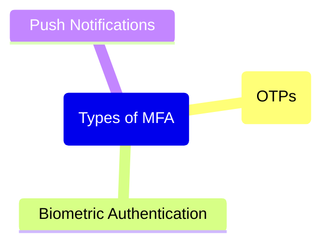

# Session
In computing, a session refers to a temporary, interactive information exchange between a user and a system, typically maintained across multiple requests and responses. 

Sessions help the system remember user-specific data, such as login status, preferences, or shopping cart contents, across various interactions. 

This stateful exchange is crucial for creating personalized and continuous user experiences in web applications, where HTTP is inherently stateless. Sessions are often tracked using unique identifiers stored in cookies or tokens, with security measures in place to prevent unauthorized access or hijacking.

We present 2 kinds of authentications for sessions:
* Session-based
* Token-based

---
## Session Based Authentications
In session-based authentication, the **server creates a session** for a user upon successful login and stores it on the server side. The **client receives a unique session ID**, typically **stored in a secure cookie**, which **it sends with each request to verify the user’s identity**.

❓**How does it work?**
* The user logs in
* The server creates a session with a unique ID stored on the server.
* This session ID is sent to the client in a cookie.
* With each new request
	* The client sends the session ID 
	* The server verifies it against its stored session data to identify the user.

```mermaid
```


**Storage and management**: Where can we store this information?

| **Serve-Side**                                                                                                          | **Client-Side**                                                                                        |
| ----------------------------------------------------------------------------------------------------------------------- | ------------------------------------------------------------------------------------------------------ |
| All session data is stored and managed on the<br>server, often in memory or a dedicated session store like<br>==Redis== | The session ID is stored on the client in a cookie, usually with secure and HttpOnly flags for safety. |


| **Pros**                                                                                                                                           | **Cons**                                                                                                                                                                                                |
| -------------------------------------------------------------------------------------------------------------------------------------------------- | ------------------------------------------------------------------------------------------------------------------------------------------------------------------------------------------------------- |
| **Server-Controlled**: Since sessions are managed server-side, session expiration or revocation can be handled directly, providing better control. | **Scalability Issues**: Storing session data on the server can cause scaling problems. Additional sessions consume more memory, and scaling horizontally requires sharing session state across servers. |
| **Simpler to Invalidate**: Sessions can be invalidated easily, making logouts or other session terminations straightforward.                       | **Heavy on Resources**: Session-based systems can be resource-intensive, especially as user numbers grow.                                                                                               |

---
## Token Based Authentications
**Token-based authentication**, often using JSON Web Tokens (JWTs), is a **stateless** approach where the **server issues a token** to the client upon successful login. 
This **token contains encoded user data** and is **stored client-side**, allowing the server to avoid storing session data.

❓**How does it work?**
* The user logs in, and the server generates a token (e.g., JWT) with encoded claims (user information).
* The token is sent to the client, which stores it (e.g., in local storage or a cookie).
* The client includes the token in headers (often the Authorization header) for each request.
* The server decodes and verifies the token without needing a persistent session store, identifying the user and their access rights.

```mermaid
```


**Storage and management**: Where can we store this information?

| **Serve-Side**                                                                                   | **Client-Side**                                                                                      |
| ------------------------------------------------------------------------------------------------ | ---------------------------------------------------------------------------------------------------- |
| **Stateless**: No session data is stored on the server, making this<br>approach highly scalable. | The client stores the token, often in local storage or cookies, which poses security considerations. |

| **Pros**                                                                                                                                                 | **Cons**                                                                                                                                                                    |
| -------------------------------------------------------------------------------------------------------------------------------------------------------- | --------------------------------------------------------------------------------------------------------------------------------------------------------------------------- |
| **Scalability**: Tokens are stateless, reducing load on the server and making horizontal scaling easier. Each server can independently verify the token. | **Token Revocation**: Since tokens are stored client-side, server side invalidation is complex. Often, token expiration is the main method of invalidation.                 |
| **Cross-Domain Flexibility**: JWTs are self-contained, making them suitable for Single Sign-On (SSO) and other cross-domain applications.                | **Security Risks**: Storing tokens in local storage can expose them to XSS attacks. I tokens aren’t properly signed and managed, they’re vulnerable to tampering or misuse. |

---
## Session vs Token: Key Differences

| **Session-Based**                                                                                                                  | **Client-Based**                                                                                                                                               |
| ---------------------------------------------------------------------------------------------------------------------------------- | -------------------------------------------------------------------------------------------------------------------------------------------------------------- |
| Maintains state server-side, allowing for easy control over session duration and termination.                                      | Stateless, stored client-side enabling greater scalability and ease of use for distributed systems.                                                            |
| Can require load balancing strategies to manage session data across multiple servers.                                              | More scalable, as no session data is stored server-side, making it suitable for microservices and serverless architectures.                                    |
| Offers more control over session invalidation; typically, less exposed to client-side storage risks.                               | Prone to client-side storage vulnerabilities; token expiration and refresh strategies are necessary to mitigate risks.                                         |
| *Example*: **Common in applications where server control over user sessions is essential**, such as ==financial or banking apps==. | *Example*: Ideal for **applications requiring scalability and flexibility**, like Single Sign-On (SSO), ==mobile applications==, or ==APIs in microservices==. |

---
## Cookies
Cookies are small pieces of **data stored on the client’s browser**, allowing the server to identify users and maintain session states across multiple HTTP requests.

In **session-based authentication**, a unique session ID is often stored in a cookie on the client. When the client makes a request, it automatically sends this cookie, allowing the server to identify the associated session data.

### Flags

| **Secure Flag**                                                                                                               | **HttpOnly Flag**                                                                                                                                                                         | **SameSite Attribute**                                                                                                                                                                   |
| ----------------------------------------------------------------------------------------------------------------------------- | ----------------------------------------------------------------------------------------------------------------------------------------------------------------------------------------- | ---------------------------------------------------------------------------------------------------------------------------------------------------------------------------------------- |
| When enabled, this flag ensures cookies are **only sent over HTTPS** connections, preventing exposure over insecure networks. | This flag makes the cookie **inaccessible to client-side scripts**, mitigating risks from Cross-Site Scripting (XSS) attacks where malicious scripts attempt to access sensitive cookies. | **Limits cookie access across different sites**. With SameSite=Strict, the cookie is only sent on requests **from the same domain**, reducing Cross Site Request Forgery (CSRF) attacks. |


---
## Tokens
JSON Web Tokens (JWTs) are used to implement **stateless authentication** by embedding user information directly within the token itself.

After login, the server generates a JWT, typically containing claims (data) about the user, like user ID and roles, along with an expiration time. This token is digitally signed to prevent tampering and then sent to the client for storage.

### Parts of a Token
A JWT consists of **three parts**: 
* **Header**, indicating the signing algorithm and token type;
* **Payload**, containing user information and claims;
* and **Signature**, which verifies the token’s integrity.

```mermaid
```

❓**Why do we need a signature?** 
The token’s payload is Base64-encoded and **easily readable** ❌, so it’s essential to avoid placing sensitive data within it. The signature helps **verify** that the **token hasn’t been altered**.

❓**Where can we store JWTs?**

| **Storing JWTs in local storage**                                                                                                                   | **Storing JWTs in cookies**                                                                                                                   |
| --------------------------------------------------------------------------------------------------------------------------------------------------- | --------------------------------------------------------------------------------------------------------------------------------------------- |
| It can expose them to XSS attacks, as they’re accessible to any JavaScript on the page.  It’s generally not recommended for sensitive applications. | (Particularly with Secure and HttpOnly flags) It can reduce the risk of XSS but requires careful configuration to avoid CSRF vulnerabilities. |

📜**Examples and Use Cases**
A Single Page Application (SPA) can use a JWT for authentication. 
* The JWT is sent to the client after login, where it’s stored in a secure, HttpOnly cookie, and included in the headers of future requests, allowing the server to authenticate without storing sessions server-side.

---
## Session Storage

**Context:** In traditional session-based authentication, session data is stored on the server. 

**Requirements**: The storage solution needs to be **fast, secure, and scalable**, particularly as the number of sessions grows.

❓**Why secure storage?** Secure storage is essential to **avoid session hijacking** and ensure that session **data remains consistent and available** during the user’s session.

📜**Examples and Use Cases**
* 🟢**Redis** is often used for session storage due to 
	* ✅ Its **high speed and support for automatic data expiration**. 
	* ✅ It’s particularly **effective for distributed systems**, as it can handle a high volume of **concurrent session** reads and writes.
* 🟡**Traditional SQL** databases can store session data, though 
	* ❌ They may introduce latency and
	* ❌ They are not as efficient for high-throughput scenarios.
* 🟢 For **scalability and flexibility**, **NoSQL databases** (like MongoDB) are sometimes used, especially when session data needs to be distributed across multiple nodes.

Here is a generated example of Redis for Session Storage
```mermaid
```

---
## Session Expiration
How can we make a session expire?

| **Timeout-Based Expiration**                                                                                 | **Absolute Expiration**                                                                        | **Idle Expiration with Sliding Window**                                                                    |
| ------------------------------------------------------------------------------------------------------------ | ---------------------------------------------------------------------------------------------- | ---------------------------------------------------------------------------------------------------------- |
| After a fixed period of inactivity, the session is deleted from storage, ensuring old sessions aren’t reused | Limits the session lifetime, regardless of activity, to reduce exposure from forgotten logins. | Extends the session’s lifespan based on user activity, providing flexibility without compromising security |

📜**Examples and Use Cases - Redis**
In a high-traffic application, **Redis** can store session data. 
* When a user logs in, the server generates a session ID and associates it with user data in Redis.
* Expiration is set at 30 minutes, and each time the user makes a request, the expiration is extended to ensure seamless access while protecting against abandoned sessions.

```mermaid
```

---
## Security risks in sessions management

Ensuring secure session management is critical to protect user data, prevent unauthorized access, and maintain trust in web applications. 

Sessions are vulnerable to various security threats that can lead to data breaches and
compromised accounts. 

Key security risks include:

| Risk                                  | Definition                                                                       | Scenarios                                                                                                     |
| ------------------------------------- | -------------------------------------------------------------------------------- | ------------------------------------------------------------------------------------------------------------- |
| **Session Hijacking**                 | Attackers steal session IDs to impersonate users                                 | This can occur through insecure connections, weak session ID generation, or Man-in-the-Middle (MITM) attacks. |
| **Cross-Site Scripting (XSS)**        | Malicious scripts can be injected into a website and executed by users’ browsers | If session cookies are accessible, attackers can steal them to gain access to user accounts.                  |
| **Cross-Site Request Forgery (CSRF)** | CSRF exploits a user's active session to make unauthorized changes               | By tricking a user into performing unintended actions on a site where they’re authenticated                   |
| **Session Fixation**                  | An attacker sets a known session ID for a user                                   | They can later use to access the user's session if the session ID remains unchanged after login.              |
| **Insecure Cookie Handling**          | Storing session IDs in cookies without secure attributes like HttpOnly or Secure | It can expose sessions to theft,<br>especially in public or compromised networks                              |

### Session Hijacking - In detail
Session hijacking is an attack where a malicious actor gains unauthorized access to a user’s session by stealing their session ID. 
This ID serves as a unique identifier that allows the attacker to impersonate the user, potentially accessing sensitive data or performing unauthorized actions.

❓**How can this happen?**
* MITM Attacks
* Session Fixation
* Session Prediction

🛡️**Preventive Measures**

| Secure Tokens                                                                                                                                              | Regenerating Session IDs                                                                         | HTTPS and Secure Cookies                                                                                                               | Session Timeout                                                                                             |
| ---------------------------------------------------------------------------------------------------------------------------------------------------------- | ------------------------------------------------------------------------------------------------ | -------------------------------------------------------------------------------------------------------------------------------------- | ----------------------------------------------------------------------------------------------------------- |
| Use cryptographically secure<br>and random session IDs to make guessing difficult. For high-security requirements, tokens with high entropy are essential. | After login or privilege escalation, regenerate the session ID to avoid session fixation attacks | Ensure all data,<br>including session IDs, is transmitted over HTTPS and stored with the Secure flag to avoid interception in transit. | Set session timeouts for idle users and limit session durations to reduce exposure if an ID is compromised. |

### Cross-Site Scripting (XSS) - In detail
Cross-Site Scripting (XSS) is a vulnerability that allows attackers to inject malicious scripts into a website viewed by other users. 
Once injected, the script can run in the victim’s browser, potentially accessing session cookies and sensitive data.

**Types**
We have mainly 3 types of XSS Attacks

```mermaid
mindmap
	root("Type of XSS Attack")
		Stored XSS
		Reflected XSS
		DOM-Based XSS
```


🛡️**Preventive Measures**
What can we do to prevent this?

| Sanitizing and Escaping Inputs                                                                                                       | Use HttpOnly Cookies                                                                                   | Content Security Policy (CSP)                                                                                                                             |
| ------------------------------------------------------------------------------------------------------------------------------------ | ------------------------------------------------------------------------------------------------------ | --------------------------------------------------------------------------------------------------------------------------------------------------------- |
| Ensure all user<br>inputs are properly sanitized and escaped to prevent malicious code from being interpreted as executable scripts. | Cookies marked with HttpOnly can’t be accessed by JavaScript, preventing session ID theft through XSS. | Implement CSP headers to restrict sources from which scripts, styles, and other resources can be loaded, reducing the risk of injected scripts executing. |

### Cross-Site Request Forgery (CSRF)
Cross-Site Request Forgery (CSRF) tricks users into executing unwanted actions on a web application where they’re authenticated. 
By manipulating requests, an attacker can perform unauthorized actions on behalf of the user, like transferring funds or changing account details.

❓**How does it work?**
CSRF relies on the user being logged in to the target application. 
* The attacker crafts a request and embeds it in a link or form. 
* When the user, while logged in, clicks or submits it, the request is sent with their session information, performing the malicious action.

For example, if a user is logged into a banking application, an attacker might send them a link that triggers a money transfer.

🛡️**Preventive Measures**
What can we do to prevent this?

| CSRF Tokens                                                                                                                                                                             | SameSite Cookies                                                                                                                                                                                    | Double Submit Cookies                                                                                                                                    |
| --------------------------------------------------------------------------------------------------------------------------------------------------------------------------------------- | --------------------------------------------------------------------------------------------------------------------------------------------------------------------------------------------------- | -------------------------------------------------------------------------------------------------------------------------------------------------------- |
| Generate a unique CSRF token for each user session. The application validates this token with each state changing request (like submitting a form), ensuring the request is legitimate. | Set cookies with SameSite attribute to prevent them from being sent with cross origin requests. SameSite=Lax or SameSite=Strict restricts cookies from being sent with requests from other domains. | In this approach, a CSRF token is stored both as a cookie and in a request parameter (usually a hidden form field), which the server checks for a match. |

---
## Session Best Practices

### 1 - Session Timeout and Expiry
Setting a reasonable expiration time for sessions is critical to limit the duration of potential unauthorized access if a session is compromised. Session timeouts ensure that idle sessions are closed, minimizing the risk of hijacking.

⏲️**Expiry duration and cases**

| Case                       | Practice                                                                                          | Example             |
| -------------------------- | ------------------------------------------------------------------------------------------------- | ------------------- |
| **Sensitive** Applications | Short timeouts, typically 5-15 minutes of inactivity, help secure user data                       | Banking, Healthcare |
| **General** Applications   | Slightly longer durations, such as 30 minutes to an hour, balance security with user convenience. | Social Media        |

**Types of Expiry**

| Idle Timeout                                   | Absolute Timeout                                                |
| ---------------------------------------------- | --------------------------------------------------------------- |
| Ends the session after a period of inactivity. | Ends the session after a fixed duration, regardless of activity |

**Best Practice**: Implement a sliding timeout policy where each valid action extends the session, combined with absolute timeouts to prevent prolonged access.


### 2 - Regenerating Session IDs
Regenerating session IDs helps prevent session fixation attacks, where an attacker tricks a user into logging in with a known session ID, allowing the attacker to later use that session.

⏲️ **When do we regenerate?**

| On Login                                                                                                                               | On Privilege Escalation                                                                                                                                            |
| -------------------------------------------------------------------------------------------------------------------------------------- | ------------------------------------------------------------------------------------------------------------------------------------------------------------------ |
| Generating a new session ID after<br>login ensures that any pre-existing session ID (potentially known by an attacker) is invalidated. | When a user changes privilege levels (e.g., from guest to admin), regenerating the session ID prevents unauthorized access if the previous session ID was exposed. |

🚧 **How can we implement this?**

| Session ID Rotation                                                                                               | Invalidate Old Sessions                                                           |
| ----------------------------------------------------------------------------------------------------------------- | --------------------------------------------------------------------------------- |
| In frameworks like Node.js or Django, use built-in methods to rotate or replace session tokens on specific events | Once a session ID is regenerated, invalidate the old session ID to prevent reuse. |

**Best Practice**: Rotate session IDs frequently for high-security applications, ensuring any active sessions are consistently unique and protected.


### 3 - Encryption and Integrity
Encrypting session data is critical to secure information both 
* **In transit** (e.g., using HTTPS) and 
* **At rest** (e.g., storing session data in databases).

| **In transit**                                                                                                                         | At rest                                                                                                                                                           |
| -------------------------------------------------------------------------------------------------------------------------------------- | ----------------------------------------------------------------------------------------------------------------------------------------------------------------- |
| HTTPS should always be used to encrypt data exchanged between the client and server, protecting session information from interception. | Sensitive session data stored on the server (like access tokens) should be encrypted, ensuring that even if data storage is compromised, data remains unreadable. |

🔒**How do we ensure data integrity?**

| Signing Tokens                                                                                                                                          | Hashing Sensitive Data                                                                                                               |
| ------------------------------------------------------------------------------------------------------------------------------------------------------- | ------------------------------------------------------------------------------------------------------------------------------------ |
| Sign tokens such as JSON Web Tokens (JWTs) to prevent tampering. The server can verify the signature to ensure the token’s content hasn’t been altered. | For additional security, use hashing algorithms (e.g., SHA 256) to store hashed versions of sensitive data like session identifiers. |

**Best Practice**: Use modern cryptographic algorithms and libraries, and implement regular audits on session data security practices to ensure data integrity and privacy.


### 4 - Multi-Factor Authentication (MFA)
Multi-Factor Authentication adds an additional layer of security by requiring multiple
verification methods, typically a combination of something the user knows (password), something the user has (mobile device), or something the user is (biometric data).

✅ **Benefits**
*  **Protection Against Unauthorized Access**: Even if session IDs or credentials are compromised, an attacker without access to the additional authentication factor (like an MFA code) cannot log in.
*  **Increased Security for High-Value Accounts**: MFA is particularly important for accounts with sensitive data or administrative privileges.

**Types**
We have mainly 3 types of MFA




| One-Time Passcodes (OTPs)                                                         | Biometric Authentication                                                                                   | Push Notifications                                                                                                    |
| --------------------------------------------------------------------------------- | ---------------------------------------------------------------------------------------------------------- | --------------------------------------------------------------------------------------------------------------------- |
| Temporary codes sent via SMS or generated by an app like Microsoft Authenticator. | Face recognition, fingerprint scanning, or other biometrics provide a secure, user-friendly second factor. | Login confirmation via a push notification to a registered mobile device, adding an extra layer of user verification. |

**Best Practice**: Implement MFA for high- security applications and sensitive accounts, ensuring it’s user-friendly and accessible without compromising security.

